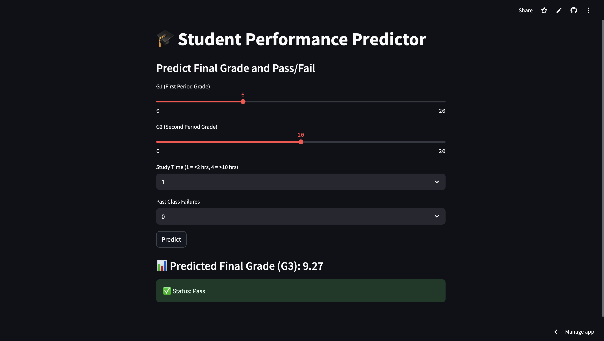

# 🎓 Student Performance Predictor

A machine learning web app that predicts a student’s final grade (G3) and pass/fail status using:
- 🧮 Linear Regression (for G3)
- 🎯 Logistic Regression (for pass/fail)

## 🔍 Features
- Predicts final exam score (G3)
- Classifies student as Pass or Fail
- Based on G1, G2, study time, and past failures
- Hosted on Streamlit Cloud

## 🚀 Live Demo
👉 [Open Live App](https://student-performance-app-5983.streamlit.app)

## 📂 Files
- `streamlit_app.py` – Streamlit UI + ML logic
- `student-mat.csv` – Dataset
- `requirements.txt` – For deployment

## 📚 Dataset
- Source: UCI Student Performance Dataset
- [Link](https://archive.ics.uci.edu/ml/datasets/student+performance)

## 🛠️ Tools Used
- Python, Pandas, Scikit-learn, Streamlit, ChatGPT

## 👩‍💻 Created by
Anushka Gupta – [GitHub Profile](https://github.com/anushkagupta1901)

## 🖼️ App Screenshot

